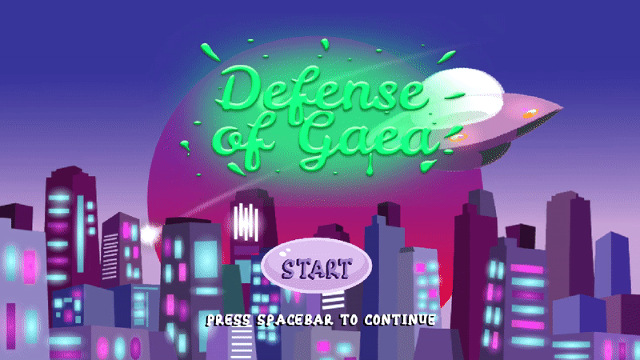

# Defense of Gaea 

Defense of Gaea is a fast, arcade-style action game with no timeouts

## Gameplay
---
> Players will continue to play until all of the plastic monsters have been killed or until the plastic monsters kill them

**Overall Goal:** Complete all levels of defending the homebase and defeating all plastic monsters

**Goal Per Level:** Defeat all plastic monsters in the level, and survive within the given time.

**Combat:** Build and remove towers that will allow you to shoot bullets to kill the monsters. Recycle plastic monsters to create new bullets and build more towers

## Controls
---
 - Easy to learn and play with `WASD` or arrow key controls 
 - Combined with building game controls (`Q` to switch, `E` to build, and `R` to remove keys)

## Tech Used
---
- GDScript
- Godot Engine